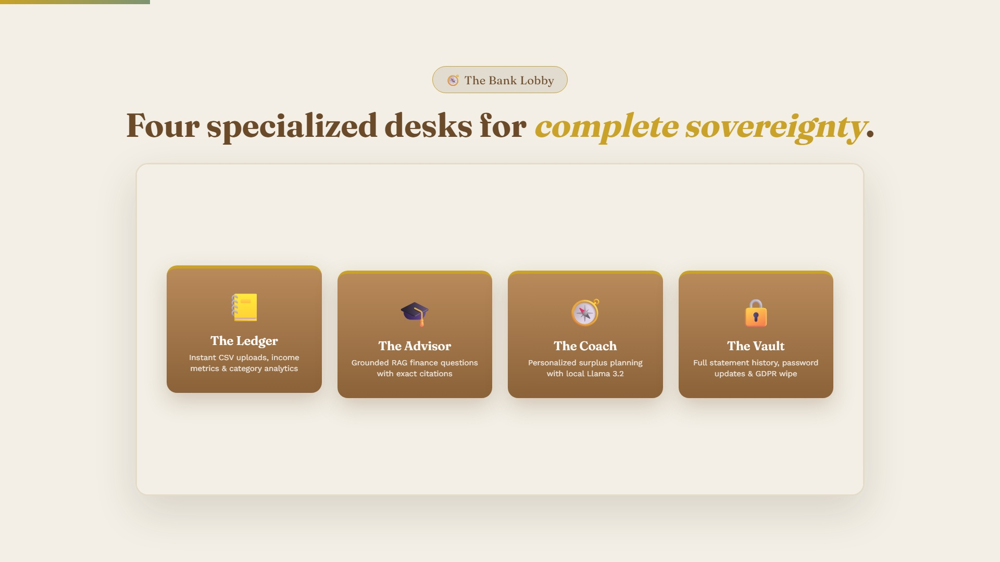
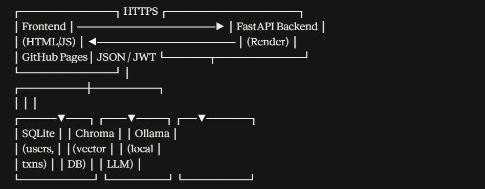
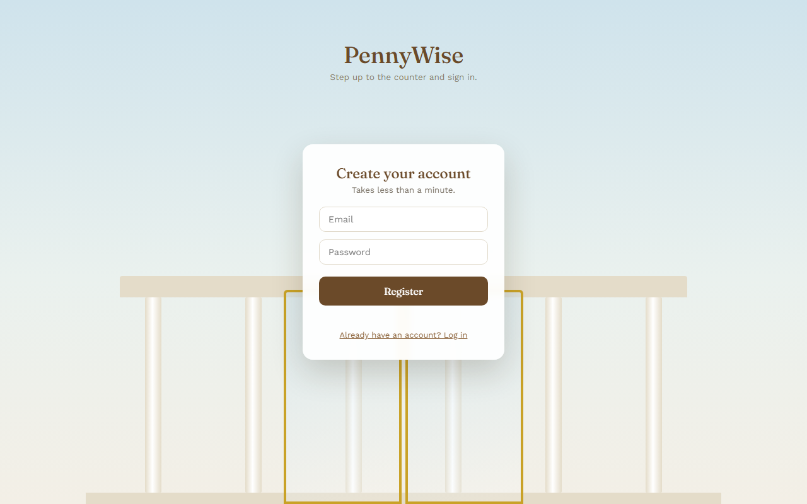
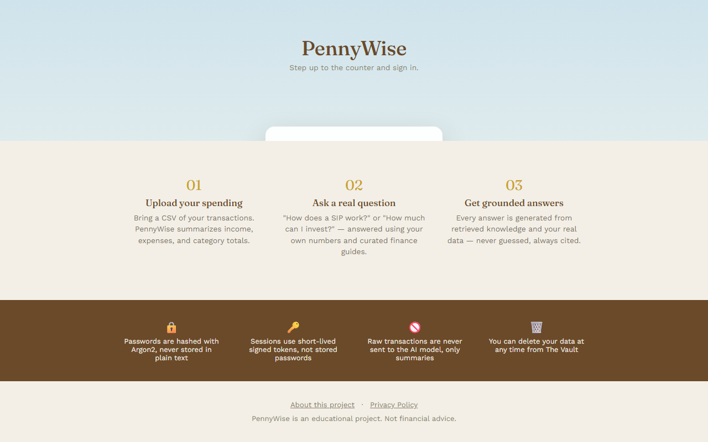
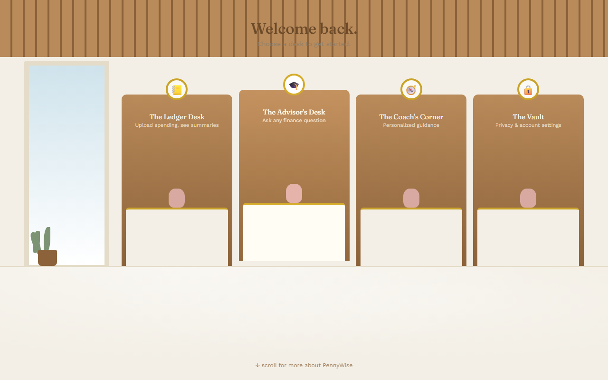
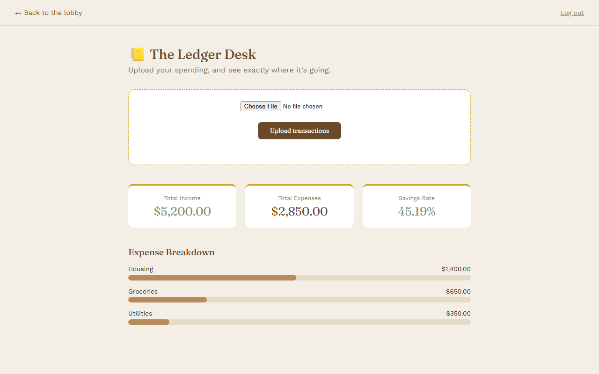
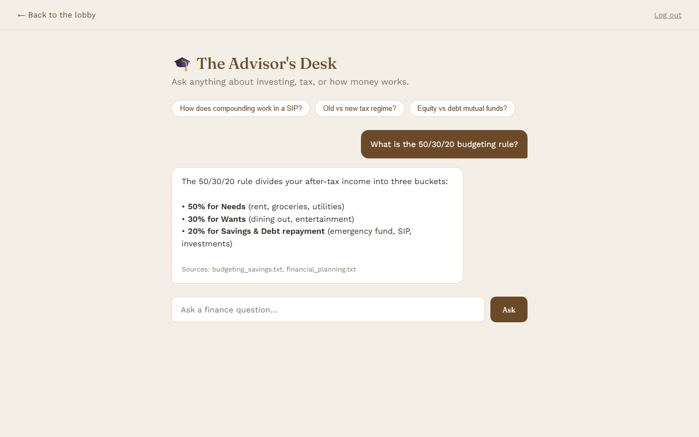
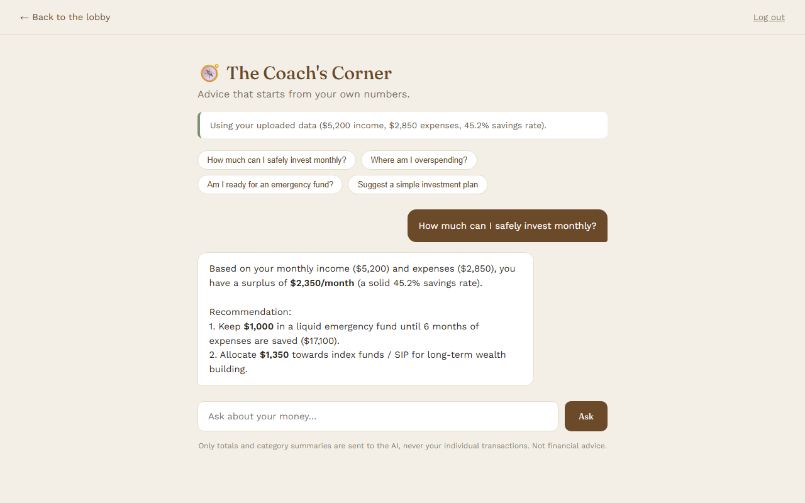
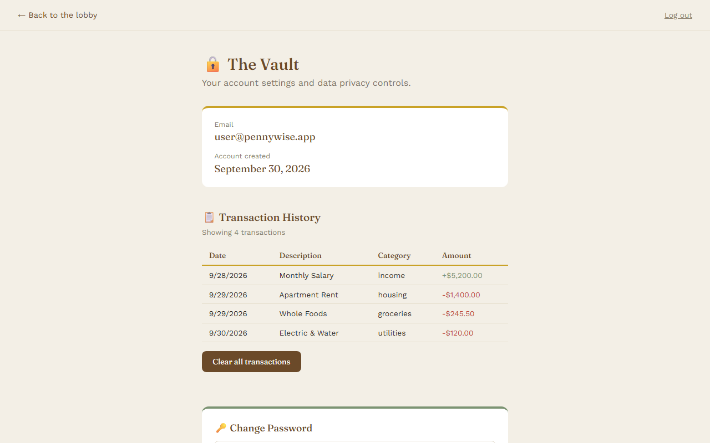

# 🏦 PennyWise — Local AI Personal Finance Coach

> An educational, privacy-first personal finance platform powered by FastAPI, SQLite, ChromaDB RAG, and local Ollama LLMs.

[](docs/pennywise_demo.mp4)

*🎬 **[Click here to watch the full PennyWise Demo Video](docs/pennywise_demo.mp4)**.*

---


## 🏛️ Architecture Overview

PennyWise is designed so that **raw transactions never leave your machine**. Analytical summaries are computed locally and combined with curated financial knowledge retrieved from ChromaDB before being processed by a local Llama 3.2 model.



```
┌─────────────────────────┐           HTTPS            ┌───────────────────────────┐
│     Frontend (HTML/JS)  │ ◄────────────────────────► │     FastAPI Backend       │
│  (Bank Lobby Interface) │         JSON / JWT         │  (Rate Limiting & CORS)   │
└─────────────────────────┘                            └─────────────┬─────────────┘
                                                                     │
                                 ┌───────────────────────────────────┼───────────────────────────────────┐
                                 ▼                                   ▼                                   ▼
                      ┌──────────────────────┐            ┌──────────────────────┐            ┌──────────────────────┐
                      │    SQLite Database   │            │   Chroma Vector DB   │            │   Local Ollama LLM   │
                      │ (Users, Transactions)│            │ (Curated Knowledge)  │            │     (Llama 3.2)      │
                      └──────────────────────┘            └──────────────────────┘            └──────────────────────┘
```

---

## 📸 Application Tour

### 1. The Gate (Authentication)
Step up to the bank counter to securely sign in or register an account. Passwords are encrypted with **Argon2id** and protected by rate limiting.

| Sign In | Registration |
| :---: | :---: |
|  |  |

---

### 2. How It Works & Privacy Guarantees
Scroll down from the entrance to view system guarantees, privacy controls, and educational principles.



---

### 3. The Bank Lobby (Dashboard)
After logging in, transition into the Bank Lobby to choose between 4 interactive desks:



---

### 4. The Four Desks

#### 📒 The Ledger Desk
Upload CSV transaction statements to instantly compute income, expenses, savings rate, and category breakdowns.



#### 🎓 The Advisor's Desk
Ask general personal finance questions grounded in curated knowledge guides via **Retrieval-Augmented Generation (RAG)** with exact source citations.



#### 🧭 The Coach's Corner
Receive personalized financial guidance tailored to your real income and expense ratios without ever sending raw transaction rows to the AI.



#### 🔒 The Vault
View full transaction history, clear financial records, change passwords with step-up verification, or permanently delete your account and all data.



---

## 🛠️ Technology Stack

- **Backend Framework**: [FastAPI](https://fastapi.tiangolo.com/) (Python 3.12)
- **Database & ORM**: [SQLite](https://sqlite.org/) with [SQLAlchemy 2.0](https://www.sqlalchemy.org/)
- **Authentication**: Argon2 (`argon2-cffi`) password hashing & PyJWT bearer tokens
- **Data Analytics**: [Pandas](https://pandas.pydata.org/) & NumPy
- **Vector Database (RAG)**: [ChromaDB](https://www.trychroma.com/) with SentenceTransformers (`all-MiniLM-L6-v2`)
- **Local AI / LLM**: [Ollama](https://ollama.com/) running `llama3.2:3b`
- **Security**: Custom sliding-window rate limiting, HTTP security headers (`nosniff`, `DENY`), access logging middleware, and safe global exception boundaries
- **Frontend**: Vanilla HTML5, CSS3 (Bank Facade Aesthetic), and modern JavaScript (ES6 Modules & Fetch API)

---

## 🚀 Quickstart Guide

### Prerequisites
- Python 3.11+
- [Ollama](https://ollama.com/) installed and running locally

### 1. Clone the Repository
```bash
git clone https://github.com/your-username/PennyWise.git
cd PennyWise
```

### 2. Set Up Virtual Environment & Dependencies
```bash
python -m venv .venv

# On Windows:
.venv\Scripts\activate

# On macOS/Linux:
source .venv/bin/activate

pip install -r backend/requirements.txt
```

### 3. Pull the Local AI Model
```bash
ollama pull llama3.2:3b
```

### 4. Ingest Knowledge Base into ChromaDB
```bash
python backend/scripts/ingest.py
```

### 5. Start the FastAPI Backend Server
```bash
cd backend
uvicorn app.main:app --reload --port 8000
```
*API documentation and interactive Swagger UI will be available at `http://127.0.0.1:8000/docs`.*

### 6. Launch the Frontend
In a new terminal:
```bash
cd frontend
python -m http.server 5500
```
Open your browser at **`http://127.0.0.1:5500/index.html`**.

---

## 🔒 Security & Privacy Features

- **Argon2 Password Hashing**: State-of-the-art memory-hard password derivation algorithm.
- **Short-Lived Signed JWTs**: Stateless authentication tokens with configurable expiration.
- **Sliding-Window Rate Limiting**: In-memory protection on `/auth/login` (5/min) and `/insights/ask` (10/min).
- **Hardened HTTP Headers**: Strict `X-Frame-Options: DENY` (anti-clickjacking) and `X-Content-Type-Options: nosniff`.
- **Right to Erasure (GDPR / Privacy)**: One-click complete account and data wipe from The Vault.

---

## 📄 License
This project is built for educational and portfolio purposes.
